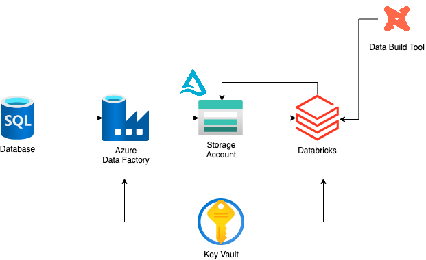

# Mini Data Platform

This repository holds code artifacts to demo
a simple data platform following a lakehouse pattern.

## System design

## Getting started

### Prerequisites

- Install the Azure CLI: `brew install azure-cli`.
- Login to Azure: `az login`.
- Set subscription: `az account set --subscription {subscription-name}`.
- Set default resource group `az configure --defaults group={group-name}`.
- Create a virtual environment: `python3 -m venv venv`.
- Activate the virtual environment: `source venv/bin/activate`.
- Install developer dependencies: `make install_dev`

## Assumptions

- A resource group is provisioned by IT.
- Firewall, networking, DNS, etc. are managed by IT.
- Using private endpoints for Blob storage, Key Vaults, etc.
- A database holding the source data for this demo exists.

Consider the following references:

- [Databricks in VNET](https://learn.microsoft.com/en-us/samples/azure/azure-quickstart-templates/databricks-all-in-one-template-for-vnet-injection/)
- [Databricks in VNET 2](https://learn.microsoft.com/en-us/azure/databricks/administration-guide/cloud-configurations/azure/vnet-inject#--virtual-network-requirements)
- [Set up an IP Access List](https://www.databricks.com/blog/2020/09/16/automate-azure-databricks-platform-provisioning-and-configuration.html)

## Post deployment actions

1. [Databricks Access Connector accesses](https://learn.microsoft.com/en-us/azure/databricks/data-governance/unity-catalog/azure-managed-identities#--step-2-grant-the-managed-identity-access-to-the-storage-account).
   1. Grant Databricks Access Connector managed identity access to the storage account.
   1. Storage Blob Data Contributor access on container,
      while only Read on storage account.
1. [Create metastore and attach a workspace](https://learn.microsoft.com/en-us/azure/databricks/data-governance/unity-catalog/get-started#--create-your-first-metastore-and-attach-a-workspace).
1. [Register compute resource provider](https://learn.microsoft.com/en-us/azure/azure-resource-manager/troubleshooting/error-register-resource-provider?tabs=azure-portal#solution).
1. [AAD integration](https://learn.microsoft.com/en-us/azure/databricks/administration-guide/users-groups/scim/).
1. [Create cluster](https://learn.microsoft.com/en-us/azure/databricks/clusters/cluster-config-best-practices).
1. Add external location in Unity Catalog using the Access Connector.
1. [Create secret scope](https://learn.microsoft.com/en-us/azure/databricks/security/auth-authz/access-control/secret-acl).
   1. Use Creator, then [assign rights to more SPs](https://learn.microsoft.com/en-us/azure/databricks/security/secrets/example-secret-workflow).
      Else, All Users can access the Key Vault content.
   1. Best to use a Key Vault dedicated to Databricks,
      and store secrets not relevant to Databricks in another Key Vault.
1. Run DataFactory pipeline to copy from DB to BLOB.
1. Run Notebooks, e.g., to create an external table and a managed table.
1. Transform data with dbt.

## To Do

- [ ] Add a CI stage.
- [ ] Add environment handling for the CD stage.
- [ ] Add Databricks, DataFactory and dbt code artifacts to the respective repositories.
- [ ] Set up Purview.
